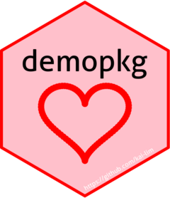

<!-- README.md is generated from README.Rmd. Please edit that file -->

```{r, include = FALSE}
knitr::opts_chunk$set(
  collapse = TRUE,
  comment = "#>",
  fig.path = "man/figures/README-",
  out.width = "100%"
)
```


# demopkg 

<!-- badges: start -->

[](https://lifecycle.r-lib.org/articles/stages.html#experimental)

[](https://doi.org/10.1098/rspb.2004.2824)

[](https://orcid.org/0000-0001-5709-4966)
<!-- badges: end -->

The goal of demopkg is to practice making a package.

## Installation

You can install the development version of demopkg like so:

``` r
devtools::install_github("kai-lim/demopkg)
```

